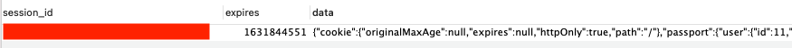

# 게시판 만들기

Vue.js 와 데이터베이스(MySQL), 클라우드 서버(AWS) 학습을 주 목적으로 진행하는 프로젝트 입니다.

문서는 공부한 내용을 정리하는 방식으로 작성합니다.

[DEMO](http://3.36.53.67) <- 테스트 해보세요 :) <br/>
소셜 로그인 기능을 추가하고부터 배포를 중단합니다. 도메인이 없어 소셜 로그인 기능을 활용할 수 없습니다 :(

<br />

## 목차

- [Frontend](#Frontend)
  - [Vue Router](#Vue-Router)
  - [Vuex](#Vuex)
  - [axios로 API 요청](#axios로-API-요청)
  - [Webpack Proxy 설정](#Webpack-Proxy-설정)
  - [CORS issue](#CORS-issue)
  - [nginx 로 배포](#nginx-로-배포)
  - [네비게이션 가드](#네비게이션-가드)
    - [중첩된 라우트](#중첩된-라우트)
    - [라우트별 가드](#라우트별-가드)
    - [라우터에서 Store 사용하기](#라우터에서-Store-사용하기)
- [Backend](#Backend)
  - [Nodejs MySQL](#Nodejs-MySQL)
  - [Express Generator](#Express-Generator)
  - [pm2](#pm2)
  - [비밀번호 암호화하기](#비밀번호-암호화하기)
    - [Crypto](#Crypto)
  - [Passport를 이용한 소셜 로그인](#Passport-를-이용한-소셜-로그인)
- [데이터베이스](#데이터베이스)
  - [MySQL 설치](#MySQL-설치)
  - [데이터베이스(schema)의 생성, 삭제, 확인](<#데이터베이스(schema)의-생성,-삭제,-확인>)
  - [표 (table)](<#표-(table)>)
  - [페이징의 구현](#페이징의-구현)
  - [관계형 데이터베이스의 필요성](#관계형-데이터베이스의-필요성)
    - [JOIN](#JOIN)
  - [MySQL Workbench 설치](#MySQL-Workbench-설치)
  - [데이터베이스 보안](#데이트베이스-보안)
    - [SQL Injection](#SQL-Injection)
    - [Escaping](#Escaping)
  - [참조 무결성](#참조-무결성)
- [아마존 웹 서비스](<#아마존-웹-서비스-(AWS)>)
  - [EC2](#EC2)
    - [인스턴스(Linux) 접속](<#인스턴스(Linux)-접속>)
  - [AWS 제어 방법들](#AWS-제어-방법들)
  - [Javascript로 AWS 제어](#Javascript-로-AWS-제어)
  - [RDS 서버 생성하기](#RDS-서버-생성하기)
  - [RDS 인스턴스에 접속해보기](#RDS-인스턴스에-접속해보기)
  - [mariaDB 한글 입력 오류 해결 방법](#mariaDB-한글-입력-오류-해결-방법)

<br />

## Frontend

### Vue Router

페이지 이동 시 데이터를 전송하는 법은 `params`로 전달하는 법과 `query`로 전달하는 법이 있습니다. <br />
간단한 예시 코드를 통해 사용 방법을 기록하겠습니다.

현재 vue-router 에 아래와 같은 라우터들이 등록되어 있다고 가정합니다.

```javascript
import { createRouter } from "vue-router";
import Home from "./Home";
import Next from "./Next";

export default createRouter({
  routes: [
    {
      path: "/",
      component: Home,
    },
    {
      path: "/next",
      component: Next,
    },
  ],
});
```

```html
<!-- Home.vue -->
<template>
  <div class="Home">
    <router-link :to="{ path: '/next' }"> NEXT로! </router-link>
  </div>
</template>
```

```html
<!-- Next.vue -->
<template>
  <div class="Next">
    <router-link :to="{ path: '/' }"> 홈으로! </router-link>
  </div>
</template>
```

각 페이지에서 서로 왔다갔다 하는 태그가 있는 아주 간단한 예제입니다. 이 때 서로 데이터를 주고 받도록 하려고 합니다. home 에서 next 로 'From Home' 이라는 메세지를, next 에서 home 으로 'From Next' 라는 메세지를 보내 보겠습니다.

```html
<!-- Home.vue -->
<template>
  <div class="Home">
    <router-link
      :to="{
      path: '/next',
      params: {
        message: 'From Home!'
      }}"
    >
      NEXT로!
    </router-link>
    <div>{{ $route.params.message }}</div>
  </div>
</template>
```

```html
<!-- Next.vue -->
<template>
  <div class="Next">
    <router-link
      :to="{ 
      path: '/',
      params: {
        message: 'From Next!'
      }}"
    >
      홈으로!
    </router-link>
    <div>{{ $route.params.message }}</div>
  </div>
</template>
```

params 속성을 추가하여 전달할 데이터를 지정하고, 받는 측에서는 `$route.params.키` 형식으로 받으면 되겠습니다.

태그에 너무 많은 코드를 쓰는 것은 별로 안 좋아하므로, `methods`로 따로 빼겠습니다.

```html
<template>
  <div class="home" @click="toNext">Next로!</div>
</template>

<script>
  export default {
    methods: {
      toNext() {
        this.$route.push({
          path: "/next",
          params: {
            message: "From Home",
          },
        });
      },
    },
  };
</script>
```

params 로 전달한 데이터는 받는 컴포넌트에서 `props`로 대신해서 사용할 수 있습니다. 이 때 라우터 구성에서 받는 컴포넌트 측의 props를 true로 변경해주어야 합니다.

```javascript
// ./routes/index.js
import { createRouter } from "vue-router";
import Home from "./Home";
import Next from "./Next";

export default createRouter({
  routes: [
    {
      path: "/",
      component: Home,
    },
    {
      path: "/next",
      component: Next,
      props: true,
    },
  ],
});
```

```html
<!-- Next.vue -->
<template>
  <div class="Next">{{ message }}</div>
</template>

<script>
  export default {
    props: {
      message: {
        type: String,
        default: "",
      },
    },
  };
</script>
```

params 대신 query 형식으로 사용하려면 코드의 `params` 대신 `query`로 바꿔주면 됩니다. <br />
받는 쪽에서도 `$route.query.message` 와 같이 받아 사용하면 되겠습니다.

```html
<template>
  <div class="home" @click="toNext">Next로!</div>
</template>

<script>
  export default {
    methods: {
      toNext() {
        this.$route.push({
          path: "/next",
          query: {
            message: "From Home",
          },
        });
      },
    },
  };
</script>
```

- params 와 query 의 특징 및 차이점
  - params 는 url에 전송할 데이터가 숨겨집니다.
  - 대신 해당 페이지에서 새로고침을 할 경우 전송받은 파라미터값을 잃게 됩니다.
  - 새로고침을 하더라도 정보를 유지하고 싶다면 query를 사용합니다.
  - query 사용 시 url에 파라미터값이 드러나게 됩니다.
    - ex) `localhost:8080/?message=From%20Home!`
  - params 로 데이터를 숨기면서 페이지를 유지하고 싶다면 `localStorage` 기능을 잘 활용해 봐야 겠습니다.

### Vuex

유저 이름을 어느 컴포넌트에서든 쉽게 사용할 수 있도록 Vue의 중앙 집중식 저장소 Vuex를 사용하겠습니다.

설치

```
$ npm i vuex@next
```

`src` 디렉토리 `store` 폴더를 하나 생성하고 `index.js`를 생성합니다. <br />

```javascript
import { createStore } from "vuex";

export default createStore({
  // Movie, About 등의 데이터 타입들이 module 에 연결된다.
  modules: {},
});
```

그리고 `main.js` 에 이 store를 사용하겠다고 선언해줍니다.

```javascript
import { createApp } from "vue";
import App from "./App";
import router from "./routes/index.js";
import store from "./sotre/index.js";

createApp(App).use(router).use(store).mount("#app");
```

특정 데이터에 관련된 state 들을 모으는 js 코드를 하나 작성해보겠습니다.

이때 핵심 내용은 `namepsaced`, `state`, `getters`, `mutations`, `actions` 입니다.

```javascript
export default {
  namespaced: true,

  state: () => {
    return {
      username: "",
    };
  },

  getters: {
    getFirstName(state) {
      return state.username.split(" ")[0];
    },
  },

  mutations: {
    setUsername(state, payload) {
      const { newName } = payload;
      state.username = newName;
    },
  },

  actions: {
    printUsername(context)) {
      console.log(context.state.username);
    },
    printUsernameObj({ state }) {
      console.log(state.username);
    }
  },
};
```

- state
  - Vue 컴포넌트에서 data와 유사합니다.
- getters
  - computed 와 유사합니다. state의 계산된 상태를 사용하게 해줍니다.
  - state의 데이터를 사용하기 위해서 인자로 state 를 넘겨주어야 합니다.
- mutations
  - methods 와 유사합니다.
  - state 를 변경할 수 있는 권한을 가집니다.
  - state 를 변경하는 메서드는 mutations 에 선언해야 하며 이 외에는 허용되지 않습니다.
- actions
  - state 를 수정하지 않는 메서드를 정의합니다.
  - actions 는 비동기 처리됩니다.
  - state 에 관련된 정보를 인자로 직접 가져오려면 context를 사용해야 하며 (`context.state`), 객체 구조 분해를 이용하여 필요한 인자만 가져올 수도 있습니다.

Vue 컴포넌트에서 스토어에 저장된 state를 사용하기 위해서는 `$store.state.모듈명.state이름` 로 호출합니다. <br />
사용 예는 아래와 같습니다.

```javascript
export default {
  created() {
    this.name = this.$store.state.user.username;
  }
  data() {
    return {
      name: '',
    }
  },
}

```

Vue 컴포넌트에서 `mutations`, `actions` 에 정의된 메서드들을 사용하기 위해서는 `$store.commit()` 과 `$store.dispatch()` 를 사용합니다. <br />
사용 예는 아래와 같습니다.

```javascript
export default {
  methods: {
    setUsername(newName) {
      // mutations
      this.$store.commit("user/setUsername", {
        newName,
      });
    },

    printUsername() {
      // actions
      this.$store.dispatch("user/printUsername");
    },
  },
};
```

<br />

### axios로 API 요청

우선 axios 를 설치합니다.

```
$ npm install axios
```

모듈을 사용하기 위해서 `app.js` 에 등록해줍니다

```javascript
// ./src/app.js

import axios from 'axios';
import VueAxios from 'vue-axios';

createApp(App).use(VueAxios, axios).mount(#app);
```

이제 특정 컴포넌트에서 API 요청을 해보겠습니다.

```html
<script>
  export default {
    data() {
      return {
        message: "",
      };
    },
    created() {
      this.$http.get("https://localhost:3000").then((response) => {
        this.message = response.data;
      });
    },
  };
</script>
```

`localhost:3000` 로 부터 응답을 받아 `message` 에 대입 시키는 아주 간단한 코드입니다.

하지만 이렇게 API 요청을 보내면 에러가 발생합니다. CORS (Cross Origin Resource Sharing)이라고 하는 브라우저-서버 간의 보안 정책 때문입니다. 현재는 localhost로 같은 도메인임에도 불구하고 포트번호가 8080과 3000으로 다르기 떄문에 다른 서버로 인식하는 듯 합니다.

이를 해결하기 위해 Webpack 개발 서버에서 api 서버로 프록싱을 합니다.

[Webpack Proxy 설정](#Webpack-Proxy-설정)

위에서 axios 모듈을 이용하여 get 방식으로 API 요청을 하는 예제 코드를 작성했습니다. <br />
아래는 post 방식으로 API 요청을 하는 예제 코드 입니다.

```html
<script>
  export default {
    data() {
      return {
        title: "Vue.js",
        description: "Vue.js is ...",
      };
    },
    addContent() {
      this.$http
        .post("/api/insert", {
          title: this.title,
          description: this.description,
        })
        .then((response) => {
          console.log(response);
        });
    },
  };
</script>
```

`$http.post()` 메서드의 두번째 인자로 보낼 데이터를 객체 형식으로 지정합니다.

<br />

### Webpack Proxy 설정

`webpack.config.js` 의 devServer에 proxy 속성을 추가합니다.

```javascript
// ./webpack.config.js

module.exports = {
  // ....
  devServer: {
    proxy: {
      "/api": "http://3.36.99.250",
    },
  },
};
```

개발 서버에 들어온 모든 http 요청 중 /api 로 시작되는 것은 모두 `http://localhost:3000`로 요청하도록 하는 설정이다.

`webpack.config.js` 를 수정한 후에는 아래와 같이 앱에서 API 요청을 할 수 있게 된다.

```html
<script>
  export default {
    data() {
      return {
        message: "",
      };
    },
    created() {
      this.$http.get("/api").then((response) => {
        // get 메서드에 url을 입력한 부분
        this.message = response.data;
      });
    },
  };
</script>
```

<br />

### CORS issue

로컬 환경의 웹앱과 EC2 인스턴스에 올려둔 API 서버와의 통신, 데이터베이스와의 연결도 모두 확인한 후 Netlify 를 이용하여 간편하게 SPA 형태로 배포하여 다른 컴퓨터에서도 앱을 테스트 해 볼 수 있게 하려 했었다.

하지만 배포 버전에서는 API 호출이 되지 않았다. 에러 메시지는 404. 그리고 어디로 API호출을 했는지 확인해보니 `https://relaxed-hopper-77fa06.netlify.app/api/content` 이었다. 엉뚱한 URL로 요청을 보내고 있다는 것은 이미 알고 있었다. [Webpack Proxy 설정](#Webpack-Proxy-설정) 파트에서 `/api` 로 시작하는 Path를 가진 URL의 호스트는 `http://3.36.99.250` 로 프록싱 설정을 함으로써, 브라우저는 `localhost:8080/api/content` 로 요청을 보낸 것으로 알고 있지만, 사실은 웹팩이 `http://3.36.99.250` 으로 프록싱하여 마치 CORS 정책을 지킨 것처럼 브라우저를 속이기 때문에 원하는 데이터를 가져올 수 있었다. 하지만 이러한 설정은 어디까지나 개발 환경에서 작동하는 로직이고, 앱을 빌드하고 서버에 올리거나 지금처럼 Netlify를 통해 배포를 한다면 더 이상 `webpack dev-server` 가 동작하지 않기 때문에 프록싱 설정은 날아가버리고 엉뚱한 곳에 API 요청을 보내게 된 것이다.

어지러운 상황이지만 어쨌든 실제 배포 환경에서는 엉뚱한 곳으로 API를 보내고 있다는 것은 명확하다. 물론 너무나도 아주 매우 당연하게도 안되겠지만 모든 URL 을 다 입력해서 요청을 보내보자.

```javascript
this.$http.get(`http://3.36.99.250/api/content`).then((response) => {
  console.log(response);
  this.contents = response.data;
});
```

그리고 너무나도 아주 매우 당연한 CORS 정책 위반에 의한 에러


앞으로 자주 볼 문제일 것 같기도 하고 근본적인 해결 방법을 찾기 위해 좋은 글을 찾아 구글링을 하기 시작했고 아래 자료를 찾아 정독!

[CORS는 왜 이렇게 우리를 힘들게 하는걸까?](https://evan-moon.github.io/2020/05/21/about-cors/)

간단히 정리해보자면

- SOP(Same-origin Policy) 라는 '무조건 같은 출처에서만 리소스를 공유할 수 있다'는 규칙을 가진 정책이 있다.
  - 출처(origin)이란? protocol(ex: http, https), host, port을 모두 합쳐 놓은 것
  - 예를 들어 `https://moonsdog.com:80/` 와 같이 path 전 까지의 모든 구성을 Origin 이라 한다.
- 무작정 막기엔 다른 출처의 리소스를 써야하는 경우가 매우 많기 때문에 몇 가지 예외를 둔 것이 CORS(Cross-Origin Resource Sharing).
- 놀랍게도 출처를 비교하는 로직은 브라우저에 구현되어 있다. CORS 정책을 위반한 요청을 하더라도 서버는 응답을 하고, 브라우저가 이 응답을 분석하여 CORS 위반이라고 판단하면 응답을 버리는 방식이다.
  - 클라이언트의 요청은 HTTP 프로토콜을 사용하여 보내는데 이 때 `요청 Header` 에 `Origin` 이라는 필드에 출처를 담아 보냄.
  - 서버가 요청에 대한 처리 후 응답을 할 때에 `응답 Header` 에 `Access-Control-Allow-Origin` 이라는 값에 이 리소스에 접근 가능한 출처의 정보를 브라우저에 보냄
  - 응답을 받은 브라우저가 `Origin` 과 `Access-Control-Allow-Origin`을 비교하여 유효한지 아닌지 판단함.

더 이상 클라이언트 파트에서 해결하는 것은 어렵다는 것을 깨달았다. 이젠 서버에서 해결을 해보자.

현재 express를 사용하고 있고, cors 라는 확장 패키지를 이용하여 아주 간단히 해결 가능하였다.

```
$ npm install cors
```

```javascript
const cors = require("cors");
const express = require("express");
const router = express.Router();

router.get("/", cors(), (req, res) => {
  res.send("Success!");
});
```

위와 같이 특정 라우터에만 cors 를 적용하는 것이 아닌 모든 라우터에 적용하고 싶다면 다른 미들웨어들이 있는 부분에 `app.use(cors())` 를 하면 된다.

그리고 `cors()` 는 모든 요청 오리진을 허용하는 것이며 위험할 수 있으나 일부 주소만 허용하는 것이 좋다

```javascript
cors({
  origin: "https://relaxed-hopper-77fa06.netlify.app/#/",
});
```

Express 가 아니더라도 간단히 요청 응답 헤더에 `Access-Control-Allow-Origin` 을 설정하면 된다.

```javascript
res.writeHead(200, {
  "Access-Control-Allow-Origin": "https://relaxed-hopper-77fa06.netlify.app/#/",
});
```

<br />

## nginx 로 배포

Netlify 로 배포한 frontend 의 프로토콜은 https 이고, 현재 AWS EC2 인스턴스에 구축한 API서버는 http 응답 프로토콜을 가지고 있으므로 Mixed Content 에러가 발생하였다. 크롬 브라우저 환경에서는 안전하지 않은 컨텐츠를 허용함으로써 테스트가 가능했으나, 휴대폰에서는 그 것이 어려웠다.

해결할 방법이 여러 가지 있을 수 있겠으나, 우선 언젠가는 Netlify 의 도움을 받지 않고 frontend 를 배포할 일이 있을 듯 하여 Nginx 를 이용하여 직접 AWS EC2에 웹서버를 구축하여 배포해보려 한다.

아주 간단한 과정으로 Vue 로 생성된 프로젝트를 배포한다.

AWS EC2 인스턴스를 생성한 후 접속한다.

```
$ ssh -i [pem 키 경로] ubuntu@[퍼블릭 IPv4 주소]
```

Nginx 를 설치한다.

```
$ sudo apt-get update
$ sudo apt-get upgrade
$ sudo apt-get install nginx
```

아주 간단한 설정을 하여 현재 Vue 프로젝트가 빌드되어 있는 `dist` 폴더를 연결한다.
`/etc/nginx/conf.d` 디렉토리에 `vuejs.conf` 파일을 생성하고 아래와 같이 입력한다.

```
server {
  listen 80;
  server_name 3.36.53.67;

  location / {
    root /home/ubuntu/(프로젝트 path)/dist;
    index index.html;
    try_files $uri $uri/ /index.html;
  }
}
```

이 후 Nginx 문법이 다 맞는지 확인한 후 Nginx 를 재시작한다.

```
$ sudo nginx -t
$ sudo systemctl restart nginx
```

http://3.36.53.67 에 접속해보면 정상적으로 배포되었음을 확인할 수 있다.

### Nginx 삭제

```
$ sudo apt-get remove nginx nginx-common  # config files를 제외하고 삭제
$ sudo apt-get purge nginx nginx-common  # 전체 다 삭제
$ sudo apt-get autoremove  # 종속성 관련 패키지 삭제
$ rm -rf /etc/nginx
```

<br/>

### 네비게이션 가드

회원가입, 로그인까지 모두 구현이 완료한 상태이고, 로그인을 하지 않더라도 글 목록 및 글 내용까지도 모두 확인할 수 있는 일반적인 웹 게시판이었습니다. 폐쇄적인 사이트, 즉 로그인을 하지 않으면 아예 이용 자체가 불가능한 사이트로 수정하라는 요구사항을 받았고, 그에 맞추어 라우팅 설계를 수정해보려 합니다.

참고자료

- [공식: 네비게이션 가드](https://router.vuejs.org/kr/guide/advanced/navigation-guards.html)
- [공식: 중첩된 라우트](https://router.vuejs.org/kr/guide/essentials/nested-routes.html)
- [라우터에서 Store 사용](https://minhanpark.github.io/today-i-learned/vue-router-guard/)

현재 라우터의 설계는 `Header`와 `Userbox`가 고정되어 있고, 한 `RouterView` 안에 `List`, `Read`, `Add`, `Login`, `Signin` 모두 들어가 있는 상태입니다.

간단히 그래프로 표현하면 아래와 같습니다.


이걸 아래와 같이 수정해보려 합니다.


그래프에 표현하지 않았지만 로그인이 되지 않으면 `Home` 으로 이동할 수 없는 구조로 만들어 폐쇄적인 사이트를 구현하도록 하겠습니다.

### 중첩된 라우트

전체를 감싸고 있는 router-view (그래프의 `app`) 안에 router-view 가 하나 더 있습니다. 이러한 형태를 vue 에서는 중첩된 라이트라고 표현을 합니다. 이를 구현하기 위해서는 `children` 이라는 키워드를 사용해야 합니다.

```javascript
// ./routes/index.js

// import (...)
export default createRouter({
  routes: [
    {
      path: "/login"
      component: Login,
      name: "Login",
    },
    {
      path: "/",
      component: Home,
      name: "Home",
      /*
        홈 View에 새로운 RouterView가 있게 하며
        아래와 같은 Component 들이 연결되도록 합니다.
      */
      children: [
        {
          path: "",
          component: List,
          name: "List",
        },
        {
          path: "add",
          component: Add,
          name: "Add",
          props: true,
        }
      ]
    }
  ]
})
```

### 라우트별 가드

[네비게이션 가드](https://router.vuejs.org/kr/guide/advanced/navigation-guards.html) <- 해당 페이지에서 전역 가드 등 네비게이션 가드에 대한 모든, 자세한 내용을 참고하도록 하고 현재는 로그인이 되어 있지 않으면 `Home` 컴포넌트에 접근할 수 없도록 만들어야 하니 라우트 별 가드만을 기록하도록 하겠습니다.

로그인을 검증하는 과정이 JWT의 내용이 들어가 있어 복잡한데 간단히 아래와 같이 라우팅을 억제할 수 있겠습니다.

```javascript
export default createRouter({
  routes: [
    {
      path: "/",
      component: Home,
      name: "Home",
      beforeEnter: (to, from, next) => {
        if (!isLoggedIn) {
          next("/login");
        } else {
          next();
        }
      },
    },
  ],
});
```

부모 컴포넌트에 `beforeEnter` 가 적용되어 있으면 `children` 에도 모두 적용됩니다.

### 라우터에서 Store 사용하기

JWT을 검증하는 내용은 재사용성을 높히기 위해서 Store 에 모두 정의해둔 상태입니다. 기존에 각 Component의 Created에서 JWT를 각각 검증하도록 되어 있으나, 라우터 중첩에서 부모 컴포넌트에 `beforeEnter` 가 적용되어 있으면 자식들도 모두 적용된다는 특징을 이용하여 router에서 store를 직접 사용하도록 합니다.

```javascript
// import (...)
import store from "../store/index";

export default createRouter({
  routes: [
    {
      path: "/",
      component: Home,
      name: "Home",
      beforeEnter: (to, from, next) => {
        if (!store.state.user.isLoggedIn) {
          // ACCESS TOKEN 검증 -> REFRESH TOKEN 검증
          store.dispatch("user/AccessTokenHandler").then((res) => {
            if (res === "NOT_VALID_ACCESS_TOKEN") {
              next("/login");
            } else {
              next();
            }
          });
        }
      },
    },
  ],
});
```

위와 같이 store를 직접 import하여 그 안의 `state`와 `dispatch` 등의 모든 store의 기능을 사용할 수 있습니다.

<br/>

---

## Backend

### Express Generator

express-generator 를 이용하여 백엔드 개발 환경을 간단히 구축해 보겠습니다.

설치 및 앱 구동까지를 아래의 커맨드로 구현합니다.

```bash
$ npm i express-generator -g
$ express backend --view=pug
$ cd backend
$ npm i
$ npm start
```

```javascript
// ./bin/www

var app = require("../app");
var debug = require("debug")("backend:server");
var http = require("http");

var port = normalizePort(process.env.PORT || "3000");
app.set("port", port);
```

`bin/www` 의 내용을 보니 3000번 포트에서 동작합니다. `localhost:3000` 에서 동작하는지 웹 브라우저를 열어 확인해봅니다.

`app.js` 에는 사용자 접속 시 입력한 url마다 어떻게 라우팅 시킬 것인지에 대한 설정이 보입니다. `localhost:3000/` 와 `localhost:3000/users` 로 접속하였을 때에 `indexRouter`, `usersRouter` 에 연결되는 것을 알 수 있습니다.

```javascript
var express = require("express");
var app = express();

var indexRouter = require("./routes/index");
var usersRouter = require("./routes/users");

app.use("/", indexRouter);
app.use("/users", usersRouter);
```

`./routes/index.js` 를 살짝 수정해 봅니다. `localhost:3000` 로 접속 시 'Hello World!' 를 응답 데이터로 보내보겠습니다.

```javascript
var express = require("express");
var router = express.Router();

router.get("/", function (req, res, next) {
  res.send("Hello World!");
});

module.exports = router;
```

브라우저에서 `localhost:3000` 로 접속해보면 Hello World! 가 잘 출력되는 것을 볼 수 있습니다.

<br />

### Nodejs MySQL

Node.js 환경에서 mysql 을 제어하기 위해 패키지를 설치합니다.

```
$ npm install mysql
```

`localhost:3000` 에 접속하면 데이터베이스의 내용을 출력하도록 코드를 수정해보겠습니다.

현재 localhost의 데이터베이스 서버에는 tutorial 이라는 db가 존재하고 그 안에는 `contents`, `comments` 라고 하는 스키마들이 저장되어 있습니다.

```
host: localhost
user: root
password: 111111
```

contents 의 내용은 아래와 같습니다.
id | title | description | author | created | updated
-|-|-|-|-|-
8 |HTTP |HTTP is HyperText Transfer Protocol ! | 2021-08-23 15:21:27 |2021-08-23 15:21:46
10 |CSS |CSS is ... |moonsdog| 2021-08-23 16:03:22 |2021-08-23 16:03:22
11 |Javascript |Javascript is ...| akaps |2021-08-23 16:46:18| 2021-08-23 16:46:18
12 |Node.js |Node.js is ... |egoing |2021-08-23 16:46:33 2021-08-23 |16:46:33

`./routes/index.js` 의 코드를 수정합니다.

```javascript
// ... require parts (생략)
var mysql = require("mysql");

router.get("/", function (req, res, next) {
  var connection = mysql.createConnection({
    host: "localhost",
    user: "root",
    password: "111111",
    database: "tutorial",
  });

  connection.query(`SELECT * FROM contents`, (err, contents) => {
    if (err) throw err;
    res.send(contents);
  });
});

module.exports = router;
```

- require로 mysql 모듈 가져오기
- `mysql.createConnection()` 메서드로 db server에 연결 및 tutorial db 를 사용하도록 함.
- `createConnection().query()` 메서드로 쿼리문 실행. 메서드의 두 번째 인자인 콜백 함수의 두 번째 인자 결과값을 내부에서 api 응답으로 전송.

코드를 작성한 후 `localhost:3000` 에 접속하면 contents 테이블의 내용이 json 의 형태로 출력되는 것을 확인할 수 있습니다.

<br />

### pm2

SSH Section 을 종료하더라도 서버가 계속 돌아가도록 PM2 프로세스 관리자를 사용합니다.

설치

```
npm install pm2 -g
```

명령어
동작 | 명령어
-|-
실행 | pm2 start app.js
리스트 확인 | pm2 list
중지 | pm2 stop app
재시작 | pm2 restart app
삭제 | pm2 delete app
로그확인 | pm2 log

- 서버를 실행할 때 --watch 옵션을 붙히면 코드를 수정하였을 때 서버가 알아서 재시작된다.
- ex) pm2 start app.js --watch

  <br />

## 비밀번호 암호화하기

사용자가 회원가입을 할 때에 입력했던 비밀번호를 그대로 `plain text`로 저장하는 것은 아주 위험한 일입니다. DB가 해킹당하는 순간 해커가 아주 쉽게 사용자의 비밀번호를 알게 되기 떄문입니다. 따라서 비밀번호는 반드시 암호화하여 저장하도록 해야 합니다.

웹 어플리케이션은 항상 서버에서 해싱을 해야 합니다.

그 방법에는 크게 `단방향 암호화` 와 `양방향 암호화` 가 있는데, 이번 프로젝트에서는 단방향 암호화 - 해싱을 적용하도록 하고 양방향 암호화에 대해서는 나중에 따로 간단한 프로젝트를 통해 학습해도록 하겠습니다.

### Crypto

단방향 암호화는 해싱 함수를 이용하여 구현합니다. `Node.js`에 내장되어 있는 `Crypto` 모듈을 사용하여 아주 간단하게 해싱을 해보겠습니다.

```javascript
// crypto 사용법

const crypto = require("crypto");
const encrypted = crypto
  .createHash("sha512", "secretkey")
  .update("비밀번호")
  .digest("base64");

const encrypted_2 = crypto
  .createHash("sha512", "secretkey")
  .update("비밀번호")
  .digest("base64");

console.log(encrypted === encrypted_2); // true
```

- `createHash`: 인자로 알고리즘을 넣어줍니다. (`sha256`, `sha512` 등). 두 번째 인자로 jwt의 secret과 비슷한 문자열을 넣을 수 있습니다.
- `update`: 입력받은 비밀번호를 넣어줍니다.
- `digest`: 인코딩 하는 방식을 지정합니다. `base64`, `hex`, `latin1`등의 방식이 있습니다.

같은 알고리즘에 같은 비밀키 문자열, 같은 비밀번호와 같은 인코딩 방식을 쓰면 같은 결과가 나오는 것을 알 수 있습니다. 이러한 특성을 이용하여 유저가 로그인 할 때에 똑같이 해싱하여 데이터베이스의 정보와 비교하여 로그인 가능 여부를 판단할 수 있겠습니다.

<br/>

### Salt 기법

위와 같이 간단히 해싱을 하면 안정성이 올라가기는 하지만 해커가 데이터베이스의 모든 비밀번호에 대해 어떤 결과가 나올 지를 모두 저장해 두었다면, 해싱 결과만 보고도 원래 암호를 유추할 수 있습니다. 그런 식으로 저장해 둔 정보들을 모아놓은 데이터베이스를 `레인보우 데이터베이스` 라고 합니다.

해커가 레인보우 데이터베이스를 사용하지 못하도록 하는 방법이 필요한데 그것이 `Salt` 기법입니다. Salt라는 특정 값을 통해 위에서 해싱한 결과를 변형할 수 있습니다. 비밀번호에 Salt문자열을 넣어서 상상 이상으로 많이 반복 해시화 하는 것입니다. Salt 문자열은 각 비밀번호에 모두 다른 랜덤 문자열이어야 하고, 비교할 때에 같은 Salt 문자열을 사용해야 하므로 요령껏 Salt 값을 기억할 수 있도록 해야 합니다.

해시 비밀번호를 생성해 보겠습니다.

```javascript
crypto.randomBytes(64, (err, buf) => {
  crypto.pbkdf2(
    "비밀번호",
    buf.toString("base64"),
    100000,
    64,
    "sha512",
    (err, key) => {
      saveInToDatabase(key.toString("base64"));
    }
  );
});
```

간단한 예저로 64비트의 랜덤 salt를 생성한 후에 단방향 암호화에서 가장 선호되는 방식인 `pbkdf2` 메서드를 이용하여 키를 생성합니다. 인자는 5개로 각각 `비밀번호`, `salt값`, `반복 횟수`, `비밀번호 길이`, `해시 알고리즘` 순서 입니다.

비밀번호를 비교할 때에는 `비밀번호`, `salt값`, `반복 횟수`, `비밀번호 길이`, `해시 알고리즘` 모두 같아야 같은 결과가 나옵니다.

```javascript
crypto.pbkdf2("입력비밀번호", `기존salt`, 100000, 64, "sha512", (err, key) => {
  console.log(key.toString("base64") === "기존비밀번호");
});
```

소금도 그냥 친다고 다 되는 것이 아니니 아래 글을 나중에 꼭 읽어보도록 합니다.

[비밀번호 해시에 소금치기 바르게 쓰기](https://starplatina.tistory.com/entry/%EB%B9%84%EB%B0%80%EB%B2%88%ED%98%B8-%ED%95%B4%EC%8B%9C%EC%97%90-%EC%86%8C%EA%B8%88%EC%B9%98%EA%B8%B0-%EB%B0%94%EB%A5%B4%EA%B2%8C-%EC%93%B0%EA%B8%B0)

<br/>

## Passport 를 이용한 소셜 로그인

passport 로 소셜 로그인을 구현한 기록을 문서화 하도록 하겠습니다.

아주 쉽게 타 사이트의 로그인 페이지로 이동하고 로그인 정보를 받아올 수 있고, 자체적으로 세션을 관리해주기 때문에 추가적인 로직의 구현이 필요 없다는 장점이 아주 부각되는 패키지 입니다.

### 설치

- passport 기본 패키지
- google, kakao Strategy 를 사용하기 위한 추가 패키지들 (`passport-google-oauth2`, `passport-kakao`)
- express 에서 session 기능을 사용하기 위한 패키지 (`express-session`)
- session 정보를 저장하기 위한 storage로 MySQL를 사용. 이를 위한 패키지 (`express-mysql-session`)

```
$ npm install passport passport-google-oauth2 passport-kakao express-session express-mysql-session
```

설치가 끝나면 `./app.js`에 기본적인 설정을 해보도록 하겠습니다.

설치한 모듈들을 가져옵니다.

```javascript
const passport = require("passport");
const GoogleStrategy = require("passport-google-oauth2").Strategy;
const KakaoStrategy = require("passport-kakao").Strategy;
```

passport 는 Strategy 라는 것을 사용합니다. 아래는 GoogleStrategy 를 작성한 것입니다. passport 에서 LocalStrategy 이외에 구글과 같은 다른 사이트의 로그인 기능을 사용하려면 `CLIENT_ID` 와 같은 인증 키를 반드시 받아야 합니다.

[Google Cloud](https://cloud.google.com/developers) <br/>
[Kakao Developers](https://developers.kakao.com/)

위 사이트들에서 키를 발급 받은 후에 Strategy 를 작성합니다.

```javascript
passport.use(
  new GoogleStrategy(
    {
      clientID: GOOGLE_CLIENT_ID,
      clientSecret: GOOGLE_CLIENT_SECRET,
      callbackURL: "http://localhost:3000/api/auth_social/google/callback",
    },
    async (token, tokenSecret, profile, done) => {
      return done(null, profile);
    }
  )
);
```

`cilentID` 등에 대한 인증이 끝나면 콜백함수가 실행이 되고, 인자로 `token, tokenSecret, profile, done`을 전달 받습니다. 그 중 `profile`에 필요한 유저의 정보가 들어있습니다. 대략적으로 아래와 같은 정보들이 들어있습니다.

```javascript
{
  provider: 'google',
  sub: '....',
  id: '....',
  displayName: '김현우',
  name: { givenName: '현우', familyName: '김' },
  language: 'ko',
  photos: '...' // .....
  // (....)
}
// 정말 있을 건 다 있군요!
```

이 정보를 바탕으로 아래와 같은 작업을 처리 할 수도 있습니다. 게시판에 유저에 대한 고유 식별번호를 생성해야 하는데 `provider`, `id`의 복합키로 생성해 보도록 하겠습니다.

```javascript
passport.use(
  new GoogleStrategy(
    {
      clientID: GOOGLE_CLIENT_ID,
      clientSecret: GOOGLE_CLIENT_SECRET,
      callbackURL: GOOGLE_CALLBACK_URL,
    },
    async (token, tokenSecret, profile, done) => {
      console.log("GOOGLE LOGIN!", profile);
      try {
        /* 
          1) provider (google || kakao), id 를 user 테이블에서 검색
          1-1) 없다면 (= 처음 로그인), provider, identifier, displayName 으로 새로운 record 생성
        */
        let id = await User.find(profile.provider, profile.id);
        if (!id) {
          await User.create(profile.provider, profile.id, profile.displayName);
          id = await User.find(profile.provider, profile.id);
        }

        // 필요한 정보만 세션에 저장하도록 한다. { db상 user_id, 받은 id, provider, displayName }
        return done(null, {
          id,
          identifier: profile.id,
          provider: profile.provider,
          displayName: `G-${profile.displayName}`,
        });
      } catch (err) {
        return done(err, null);
      }
    }
  )
);
```

마지막에 콜백함수의 네 번째 인자인 done 함수를 반환하였습니다. done 메서드는 기본적으로 2개의 인자를 담습니다.<br/>
`done(err, user)`<br/>
첫 번째 인자는 err 를 담아주고, 두 번째 인자에 유저 정보를 담아줍니다. err의 경우 보통 localStrategy 를 사용할 때 잘못된 로그인 정보를 입력받았을 경우의 error 핸들링을 하는 부분이라고 생각하면 됩니다. 저는 외부 사이트의 로그인 strategy 를 가져왔기 때문에 특별한 경우가 아니라면 error 에 대한 로직을 구현할 필요는 없었습니다. 따라서 `null` 로 할당해주었고, profile 의 내용을 모두 담기엔 제 사이트에서 사용하지 않는 불필요한 정보가 많이 있고 세션에 부담이 될 수 있으므로 필요한 정보만 객체에 담아 두 번째 인자로 할당해주었습니다.

다음으로 `serializeUser()`가 실행됩니다. `serializeUser()`와 `deserializeUser()`를 함께 살펴보게 되는데, 이 두 함수는 모두 세션에 관련한 기능을 수행합니다.

```javascript
passport.serializeUser((user, done) => {
  done(null, user);
});
passport.deserializeUser((user, done) => {
  done(null, user);
});
```

- `serializeUser`: 최초 로그인 시 (브라우저에 session이 없을 경우) 실행되는 함수입니다. 브라우저의 고유 session id 에 해당하는 session 정보를 서버에 생성하고 전달받은 user 정보를 생성하여 저장합니다.
- `deserializeUser`: 로그인 후 서버에 api 요청이 있을 때 마다 실행되는 함수 입니다. 해당 session id에 저장되어 있는 user 정보를 `req.user` 에 저장합니다.

이 두 함수가 로그인 세션 유지의 핵심적인 기능을 담당하고, 당연하게도 session 을 이용해야 합니다. 이를 활용하기 위해서 `express-session` 을 설치하였습니다. 또한 세션 정보를 MySQL에 저장하기 위해 `express-mysql-session` 또한 설치했습니다. 등록해 주겠습니다.

```javascript
const session = require("express-session");
const MySQLStore = require("express-mysql-session")(session);
// dbconfig: { host, user, password, database } 형태로 mysql server 에 접속하기 위한 설정
const sessionStore = new MySQLStore(dbconfig);
app.use(
  session({
    secret: sessionSecret.secret,
    resave: false,
    saveUninitialized: true,
    store: sessionStore,
  })
);
```

- `resave`: 변경사항이 없는 session도 저장할 것인지에 대한 설정입니다. 작동 효율을 높히기 위해 대부분 false로 설정합니다.
- `saveUninitialized`: 새 request가 들어와 해당 요청에서 새로 생성되어 아무 내용이 없는 세션을 저장할 것인지에 대한 설정입니다.
  - 사용자의 서버 방문 횟수가 높을 수록 좋다면 true로 설정할 수 있습니다.
  - empty session 객체가 서버에 쌓이는 것을 방지하여 스토리지를 아끼고 싶다면 false 로 설정합니다.

이제 준비가 끝났습니다. passport를 app에 등록해 줍니다.

```javascript
app.use(passport.initialize());
app.use(passport.session());
```

<br/>

이제 동작 흐름을 살펴보도록 하겠습니다.

1. Client에서 소셜 로그인 요청을 합니다.

```html
<!-- Vue.js -->
<a href="http://localhost:3000/auth_social/google">구글로 로그인</a>
```

2. 해당 페이지에서 로그인 페이지로 넘겨줍니다.

```javascript
router.get("/auth_social/google", passport.authenticate("google"));
```

3. 로그인이 되면 설정해둔 Strategy 가 동작합니다.

```javascript
passport.use(
  new GoogleStrategy(
    {
      clientID: GOOGLE_CLIENT_ID,
      clientSecret: GOOGLE_CLIENT_SECRET,
      callbackURL: GOOGLE_CALLBACK_URL,
    },
    async (token, tokenSecret, profile, done) => {
      console.log("GOOGLE LOGIN!", profile);
      try {
        let id = await User.find(profile.provider, profile.id);
        if (!id) {
          await User.create(profile.provider, profile.id, profile.displayName);
          id = await User.find(profile.provider, profile.id);
        }
        return done(null, {
          id,
          identifier: profile.id,
          provider: profile.provider,
          displayName: `G-${profile.displayName}`,
        });
      } catch (err) {
        return done(err, null);
      }
    }
  )
);
```

```pm
0|www    | GET /api/auth_social/google 302 1.665 ms - 0
0|www    | GOOGLE LOGIN! {
0|www    |   provider: 'google',
0|www    |   sub: ':D',
0|www    |   id: ':D',
0|www    |   displayName: '김현우',
0|www    |   name: { givenName: '현우', familyName: '김' },
0|www    |   given_name: '현우',
0|www    |   family_name: '김',
0|www    |   language: 'ko',
0|www    |   locale: undefined,
...(아래 생략)
```

로그인에 성공하였습니다!

4. 최초 로그인이므로 `serializeUser` 가 동작합니다.

```javascript
passport.serializeUser((user, done) => {
  console.log("SERIALIZED", user);
  done(null, {
    id: user.id,
    identifier: user.identifier,
    provider: user.provider,
    displayName: user.displayName,
  });
});
```

```pm
0|www    | SERIALIZED {
0|www    |   id: 11,
0|www    |   identifier: ':D',
0|www    |   provider: 'google',
0|www    |   displayName: 'G-김현우'
0|www    | }
```

Strategy 콜백함수에서 필요한 정보만 보내주었던 것이 잘 왔네요. done 함수가 호출되면서 두 번째 인자를 `passport.user` 속성에 알아서 넣어 데이터베이스에 저장할 겁니다.

 - 데이터베이스에 잘 저장되었네요!

5. 홈 페이지 화면으로 이동하면 `/api/content` 로 api 요청을 보내어 전체 글 목록을 가져오도록 되어 있습니다. `deserializeUser` 함수는 서버에 request가 들어올 때 마다 동작한다고 했었는데 확인 해보도록 하겠습니다.

```javascript
passport.deserializeUser((user, done) => {
  console.log("DESERIALIZED", user);
  done(null, user);
});
```

```pm
0|www    | DESERIALIZED {
0|www    |   id: 11,
0|www    |   identifier: ':D',
0|www    |   provider: 'google',
0|www    |   displayName: 'G-김현우'
0|www    | }
0|www    | GET /api/content 304 33.603 ms - -
```

- `deserializeUser` 함수가 잘 동작한 것을 볼 수 있습니다. `done` 함수가 실행되면 express의 `req`에 user 정보가 담깁니다. 이를 `req.user` 에서 확인할 수 있습니다. 실제로 `deserializeUser` 함수가 실행되고 `/api/content` 페이지로 이동하였고, 아래와 같이 유저 정보를 사용할 수 있습니다.

```javascript
/* 세션이 유효한지 판단하는 기능 */
const authenticateUser = (req, res, next) => {
  // req.user 정보가 있으면 요청에 대한 처리를 함
  // 없다면 세션이 만료되었다는 (혹은 없다는) 메세지를 되돌려 보냄.
  if (req.user) {
    next();
  } else {
    res.send("SESSION_EXPIRED");
  }
};

router.get("/content", authenticateUser, (req, res) => {
  res.send("글 목록!");
});
```

<br/>

지금까지 passport 의 기본 사용법을 기록하였고, 동작 흐름을 실제로 디버깅을 통해 확인해보았습니다. 아래는 클라이언트 측에서의 활용법을 조금 더 작성해보겠습니다.

첫 째로, 로그인 한 유저만 페이지의 정보를 열람할 수 있게 하고 싶습니다. 위에서 이미 서버사이드의 기능을 구현하였습니다. 세션이 유효하지 않다면 `SESSION_EXPIRED` 메시지를 보내도록 하였습니다. 그렇다면 글 목록을 요청하는 클라이언트의 코드에 아주 간단히 SESSION_EXPIRED 를 받았을 때에 대한 처리를 해주면 됩니다.

```javascript
this.$http.get(`${endpoint}/content`).then((response) => {
  if (response.data === "SESSION_EXPIRED") {
    // 세션이 만료되거나, 유효하지 않다면 로그인 페이지로 이동합니다.
    alert("로그인 후 이용해주세요");
    this.$router.push("/login");
  } else {
    this.contents = response.data;
  }
}
```

모든 API 호출마다 이와 같은 로직을 추가해준다면 사용자가 로그인을 하지 않는다면 그 어떤 페이지의 정보도 확인할 수 없게 할 수 있겠습니다.

두 번째로 웹 사이트에서 새로고침 하거나 창을 종료한 후 다시 웹 사이트에 접속하였을 때에 로그인이 유지되면서도 해당 유저의 기본 정보를 다시 받아와 사용할 수 있도록 해보겠습니다. `~/store/user.js` 에는 다음과 같은 정보들을 저장해두고 있습니다.

```
isLoggedin - 현재 유저가 로그인 상태인가 (default: false)
id - DB상의 유저 고유 식별 번호
nickname - 제공받은 displayName
(...)
```

고유 번호와 닉네임의 경우 각 글 수정/삭제 권한을 부여 받을 수 있도록하고, 본인의 닉네임이 화면에 나타나도록 하게 하기 위해 필요한 정보들이므로, 최초 사이트 접속 시 서버로부터 전달받아야 하는 정보입니다. 창 종료 후 다시 접속하였을 때에 `isLoggedin`은 항상 `false`인 특성을 활용합니다.

`vue-router` 의 `beforeEnter` 기능을 활용합니다. 이 기능이 설정된 페이지는 접속하기 전 beforeEnter 메서드가 동작하여 분기마다 어떤 처리를 할 지 결정할 수 있습니다.

```javascript
// (...import)

export default createRouter({
  routes: [
    path: "/",
    component: Home,
    name: "Home",
    beforeEnter: (to, from, next) => {
      if (!store.state.user.isLoggedIn) {
        axios.get(`${endpoint}/auth/session`).then(res => {
          if (res.data === "SESSION_EXPIRED") {
            next("/login")
          } else {
            const payload = res.data;
            store.commit('user/setState', payload);
            next();
          }
        })
      } else {
        next();
      }
    }
  ]
})
```

로그인이 안되어 있다는 플래그를 가지고 있을 때에 세션을 확인하여 유저 정보를 받아오는 구성입니다. 서버에 Request가 있을 때 마다 `deserializeUser`가 동작하고 유효한 세션은 항상 `req.user` 에 정보를 담아주는 특성을 이용하여 간단히 클라이언트 페이지로 유저 정보를 넘겨줄 수 있습니다. 서버의 코드는 아래와 같습니다.

```javascript
router.get("/auth/session", (req, res) => {
  // deserializeUser 가 실행되고 req에 user 정보가 담겨있다면 그 정보를 보내주고
  // 아니라면 세션이 만료되었다는 메시지를 전달한다.
  if (req.user) {
    const { id, identifier, provider, displayName } = req.user;
    res.send({ id, identifier, provider, displayName });
  } else {
    console.log("SESSION_EXPIRED");
    res.send("SESSION_EXPIRED");
  }
});
```

## 데이터베이스

데이터베이스의 핵심

- 어떻게 입력할 것인가?
- 어떻게 출력할 것인가?

입력을 어떻게 할 것인가?

- Create
- Update
- Delete

출력을 어떻게 할 것인가?

- Read

그 어떤 데이터베이스를 만나더라도 CRUD (Create, Read, Update, Delete) 가 가장 중요하다.

<br />

## MySQL 설치

Window 설치법

- 쉽게 MySQL, Apache 등을 한 번에 설치해주는 Bitnami 를 받아 설치하도록 하자.
- [설치 페이지](https://bitnami.com/stack/wamp/installer)

MacOS 설치법

[생활코딩](https://opentutorials.org/course/3161/19532) <- 강의 참고!

설치가 완료되면 `cmd` 창을 연 후 mysql.exe 가 설치되어 있는 경로로 이동한 후에 아래와 같이 실행한다.

```bash
$ cd C:\Bitnami\wampstack-8.0.9-0\mariadb\bin
$ mysql -uroot -p

Enter password: ********
```

<br />

## MySQL의 구조

(그림 파트)

| 데이터베이스         | 파일 |
| -------------------- | ---- |
| 표 (table)           | 파일 |
| 데이터베이스(schema) | 폴더 |

데이터베이스는 스키마라는 표들을 하나로 Grouping 하는 말로 쓰이기도 한다.

<br />

## 데이터베이스(schema)의 생성, 삭제, 확인

- 데이터베이스 생성

```
CREATE DATABASE database-name;
```

- 데이터베이스 삭제

```
DROP DATABASE database-name;
```

- 데이터베이스 목록 확인

```
SHOW DATABASES;
```

특정 데이터베이스를 사용하기 위해서는 해당 데이터베이스를 사용하겠다는 명령을 내려주어야 한다.

```
USE database-name;
```

<br />

## SQL

Structured <br />
Query<br />
Language<br />

관계형 데이터베이스라는 카테고리에 속하는 제품들이 공통적으로 데이터베이스 서버를 제어할 때 사용하는 언어.

<br />

## 표 (table)

| id  | title  | description  | created  |
| --- | ------ | ------------ | -------- |
| 1   | MYSQL  | MySQL is...  | 2018-1-1 |
| 2   | Oracle | Oracle is... | 2018-1-3 |

위와 같은 형태를 표, table 이라고 한다.<br />
수평 - 행, row, record<br />
수직 - 열, column

### 표 생성

```SQL
CREATE TABLE topic(
  c1 Datatype(LENGTH),
  c2 Datatype(LENGTH),
  ...
);

CREATE TABLE topic(
    -> id INT(11) NOT NULL AUTO_INCREMENT,
    -> title VARCHAR(100) NOT NULL,
    -> description TEXT NULL,
    -> created DATETIME NOT NULL,
    -> author VARCHAR(30) NULL,
    -> profile VARCHAR(100) NULL,
    -> PRIMARY KEY(id));
```

- NOT NULL : 입력값이 없지 않도록 한다.
- AUTO_INCREMENT : 중복을 방지한다.
- PRIMARY KEY : 기본키를 설정한다.

DATATYPE 요약
문법 | 내용
-|-
INT | 정수 (약 -20억~20억)
BIGINT | 매우 큰 정수

<br />

## 표의 CRUD

### 생성(CREATE) - INSERT

```sql
INSERT INTO topic (title, description, created, author, profile) values('MySQL', 'MySQL is ...', NOW(), 'moonsdog', 'developer');
```

- `INSERT INTO 테이블이름 (속성1, 속성2 ...) VALUES (값1, 값2 ...);`
- `NOW()` : 현재 시간을 알려주는 함수

- topic 테이블의 구조를 확인하기 위해서는 `DESC` 키워드를 사용한다.

```sql
DESC topic;
```

<br />

### 읽기 (READ) - SELECT <br />

가장 많이 사용하게 될 키워드이며 사용 방법이 무궁무진하므로 가장 집중해야 한다.

`SELECT (속성1, 속성2...) FROM (테이블이름) WHERE (조건)`

```sql
SELECT * FROM topic;
```

- 위 문장은 topic 테이블 안에 있는 모든 데이터를 확인.
- 함부로 사용하지 않도록 하자. 너무 많은 데이터를 사용하게 되어 컴퓨터가 다운되기 쉬움.
- 전체 데이터 중 일부만 보고 싶다면 LIMIT 을 써보자.
  - `SELECT * FROM topic LIMIT 2` - 전체 데이터 중 2개만 확인

```sql
SELECT id, title, created, author FROM topic WHERE author='egoing';

+----+---------+---------------------+--------+
| id | title   | created             | author |
+----+---------+---------------------+--------+
|  2 | Oracle  | 2021-08-20 08:33:04 | egoing |
|  5 | MongoDB | 2021-08-20 08:35:49 | egoing |
+----+---------+---------------------+--------+
```

- author 가 'egoing' 인 레코드를 id, title, created, author 로 출력

```sql
SELECT id, title, created, author FROM topic WHERE author='egoing' ORDER BY id DESC;
```

- ORDER BY (속성) (DESC | ASC) : 속성을 기준으로 오름차순(내림차순) 으로 정렬

<br />

### 수정(UPDATE) - UPDATE

`UPDATE (테이블이름) SET ('변경할 속성' = '내용'), ... WHERE (조건);`

```sql
UPDATE topic SET description='Oracle is ...', title='Oracle' WHERE id=2;
```

- WHERE 문을 빠트리면 재앙이 닥치므로 주의하자.

<br />

### 삭제(DELETE) - DELETE

`DELETE FROM (테이블이름) WHERE (조건)`

```sql
DELETE FROM topic WHERE id=5;
```

- 마찬가지로 WHERE 문을 빠트린다거나 하는 실수를 하면 새로운 인생의 전환점을 맞이하므로 주의하자.

<br />

## 페이징의 구현

현재 웹페이지는 홈 화면에 접속했을 때 데이터베이스 내에 있는 모든 글들을 가져오고 있다. 10개 남짓한 데이터로 테스트할 때야 문제가 없지만 글이 1000~10000개 이상으로 늘어나게 된다면 사용자가 보지도 않는 쓸모없는 글들을 가져오는 비효율적이게 된다. 이를 해결하기 위해 페이지 기능을 추가하며, 실제 데이터베이스에서 가져오는 정보의 수를 제어하여 효율적인 동작을 하도록 한다.

여러 방법의 페이징을 구현할 수 있다. 아래와 같은 모양의 숫자를 클릭하면 원하는 페이지의 글들을 볼 수 있는 방법도 있겠으나,

```
[1][2][3][4] ....
```

글 최하단에 '더보기' 버튼 기능을 추가하여 사용자가 클릭하였을 때에 볼 수 있는 글을 추가할 수 있도록 하려 한다.

### MySQL - LIMIT

구현하기 위해서 SQL 문의 LIMIT 키워드를 활용한다.

```SQL
SELECT * FROM contents;  # 모든 row 를 출력

SELECT * FROM contents LIMIT 0, 10;  # 0번째부터 10개의 row (0 ~ 9) 출력
SELECT * FROM contents LIMIT 10, 10;  # 10번째부터 10개의 row (10 ~ 19) 출력
```

이 기능을 Frontend 에서 동적으로 제어한다.

state 에 `currentPage` 상태를 추가.

```javascript
export default {
  data() {
    return {
      // ...
      contents = [];
      currentPage = 1;
    }
  }
}
```

그리고 더보기를 클릭했을 때에 동작할 메서드를 정의한다. 클릭 시 페이지 상태를 API서버로 넘겨주고 받은 데이터를 글 목록에 추가하고, 현재 페이지 넘버를 +1 한다.

```javascript
export default {
  data() {
    return {
      // ...
      contents = [];
      currentPage = 1;
    }
  },
  methods: {
    seeMoreContents() {
      this.$http.get(`${defaultAPI.end_point}/content/page?page=${this.currentPage}`).then(response => {
        this.currentPage += 1;
        this.contents.push(...response.data);
      })
    }
  }
}
```

API서버 측에서는 받은 페이지 넘버를 가공한 후 쿼리문을 실행하여 응답하도록 코드를 추가한다.

```javascript
/* READ MORE CONTENTS */
/* /api/content/page?page={} */
router.get("/page", (req, res) => {
  let connection = mysql.createConnection(dbConfig);
  connection.connect();

  let _url = req.url;
  let queryData = url.parse(_url, true).query;
  let pageNumber = queryData.page;
  let startIndex = pageNumber * 10;

  connection.query(
    "SELECT * FROM contents ORDER BY created DESC LIMIT ?, 10",
    [startIndex],
    (err, contents) => {
      if (err) throw err;
      connection.end();
      res.send(contents);
    }
  );
});
```

<br />

## 관계형 데이터베이스의 필요성

```
+----+------------+-------------------+---------------------+--------+---------------------------+
| id | title      | description       | created             | author | profile                   |
+----+------------+-------------------+---------------------+--------+---------------------------+
|  1 | MySQL      | MySQL is ...      | 2021-08-20 08:31:08 | egoing | developer                 |
|  2 | Oracle     | Oracle is ...     | 2021-08-20 08:33:04 | egoing | developer                 |
|  3 | SQL Server | SQL Server is ... | 2021-08-20 08:34:20 | duru   | data administrator        |
|  4 | PostgreSQL | PostgreSQL is ... | 2021-08-20 08:35:07 | taeho  | data scientist, developer |
|  5 | MongoDB    | MongoDB is ...    | 2021-08-20 08:35:49 | egoing | developer                 |
+----+------------+-------------------+---------------------+--------+---------------------------+
```

위 테이블에는 두 속성에 걸쳐 egoing 은 devloper 다 라고 하는 데이터가 중복이 되고 있다.

중복은 항상 개선의 여지가 필요함을 알리는 신호이다. 만약 'egoing' 이라는 아이디를 변경하려 한다면 위 표에서 3개의 레코드를 모두 수정해야 하는 번거로움이 있다.

이런 문제들을 개선하기 위해 테이블을 분해한다. ([정규화]())

```
+----+--------+---------------------------+
| id | name   | profile                   |
+----+--------+---------------------------+
|  1 | egoing | developer                 |
|  2 | duru   | database administrator    |
|  3 | taeho  | data scientist, developer |
+----+--------+---------------------------+
```

author 라는 테이블을 따로 생성하여 author 에 대한 정보(이름, 프로필)을 담아둔다.

topic 테이블에서는 author, profile 에 해당하는 정보는 author 테이블이 가지고 있으므로 두 열을 삭제하고 author 테이블의 id 값을 추가함으로써 관계를 생성함과 동시에 테이블을 분리가 된다.

```
+----+------------+-------------------+---------------------+-----------+
| id | title      | description       | created             | author_id |
+----+------------+-------------------+---------------------+-----------+
|  1 | MySQL      | MySQL is ...      | 2021-08-20 09:37:51 |         1 |
|  2 | Oracle     | Oracle is ...     | 2021-08-20 09:38:07 |         1 |
|  3 | SQL Server | SQL Server is ... | 2021-08-20 09:38:25 |         2 |
|  4 | PostgreSQL | PostgreSQL is ... | 2021-08-20 09:38:42 |         3 |
|  5 | MongoDB    | MongoDB is ...    | 2021-08-20 09:38:58 |         1 |
+----+------------+-------------------+---------------------+-----------+
```

이로써 author 에 대한 정보를 수정한다 하더라도 author 테이블에서 한 번만 수정하면 topic 테이블에서도 그 변경사항을 적용할 수 있게 되었다.

### JOIN

하지만 위와 같이 테이블을 분리함으로써 읽을 때에 불편함이 생겼다. topic 테이블에서 MySQL 제목의 글을 읽을 때에 이 글을 생성한 사람이 누군지 알기 위해서는 author 테이블도 읽어와야 하는 것이다.

이를 해결하기 위해 단 한 번 읽었을 때에 두 테이블 (혹은 여러 테이블)이 처음부터 합쳐져 있었던 것 처럼 출력이 되도록 한다.

`SELECT \* FROM (테이블1) LEFT JOIN (테이블2) ON (조건)

```SQL
SELECT * FROM topic LEFT JOIN author ON topic.author_id = author.id;

+----+------------+-------------------+---------------------+-----------+------+--------+---------------------------+
| id | title      | description       | created             | author_id | id   | name   | profile                   |
+----+------------+-------------------+---------------------+-----------+------+--------+---------------------------+
|  1 | MySQL      | MySQL is ...      | 2021-08-20 09:37:51 |         1 |    1 | egoing | developer                 |
|  2 | Oracle     | Oracle is ...     | 2021-08-20 09:38:07 |         1 |    1 | egoing | developer                 |
|  3 | SQL Server | SQL Server is ... | 2021-08-20 09:38:25 |         2 |    2 | duru   | database administrator    |
|  4 | PostgreSQL | PostgreSQL is ... | 2021-08-20 09:38:42 |         3 |    3 | taeho  | data scientist, developer |
|  5 | MongoDB    | MongoDB is ...    | 2021-08-20 09:38:58 |         1 |    1 | egoing | developer                 |
+----+------------+-------------------+---------------------+-----------+------+--------+---------------------------+
```

- author_id, id 속성이 쓸데없이 들어가 있으므로 삭제해본다.

```SQL
SELECT topic.id, title, description, created, name, profile FROM topic LEFT JOIN author ON topic.author_id = author.id;

+----+------------+-------------------+---------------------+--------+---------------------------+
| id | title      | description       | created             | name   | profile                   |
+----+------------+-------------------+---------------------+--------+---------------------------+
|  1 | MySQL      | MySQL is ...      | 2021-08-20 09:37:51 | egoing | developer                 |
|  2 | Oracle     | Oracle is ...     | 2021-08-20 09:38:07 | egoing | developer                 |
|  3 | SQL Server | SQL Server is ... | 2021-08-20 09:38:25 | duru   | database administrator    |
|  4 | PostgreSQL | PostgreSQL is ... | 2021-08-20 09:38:42 | taeho  | data scientist, developer |
|  5 | MongoDB    | MongoDB is ...    | 2021-08-20 09:38:58 | egoing | developer                 |
+----+------------+-------------------+---------------------+--------+---------------------------+
```

- SELECT 뒤에서 `topic.id` 를 그냥 `id` 라고만 했을 때에는 author.id 와 topic.id 둘 중에 어떤 것을 사용하는지 모호하므로 syntax error 가 뜬다. 잘 정의 해주도록 하자.
- 결과 테이블에 `id`를 `topic_id`로 바꾸고 싶다면 `SELECT topic.id AS topic_id ...` 하면 됨.

<br />

## MySQL Workbench 설치

[설치 페이지](https://dev.mysql.com/downloads/workbench/)

- 운영 체제에 맞는 프로그램을 받아 간단히 설치 가능.

<br />

## 데이트베이스 보안

### SQL Injection

외부로부터 들어온 정보에 의해 데이터베이스가 조작되어 생기는 문제.

아래의 코드는 사용자가 전송해온 URL의 쿼리로부터 id 값을 전달받아 그를 바탕으로 SQL query를 실행하는 코드이다.

```javascript
// ... connection
const _url = req.url;
const queryData = url.parse(_url, true).query;
const id = queryData.id;

connection.query(`SELECT * FROM contents WHERE id=${id}`, (err, contents) => {
  if (err) throw err;
  console.log(contents);
});
```

```URL
https://localhost:8080?id=1
```

위와 같이 정상적인 url 이 들어온다면 코드에 문제는 없을 것이다. 하지만 아래와 같은 url을 사용자가 입력한다면 문제가 생긴다.

```URL
https://localhost:8080?id=1;DROP TABLE contents;
```

이 때 실행될 쿼리문은 `SELECT * FROM contents WHERE id=1;DROP TABLE contents;` 로 contents 테이블의 모든 기록을 출력하고 contents 테이블을 삭제해버렸다.

보간법을 사용하면 전체 문장을 한 명령으로 보기 때문에 2개의 쿼리문이 모두 동작한 것이다. 이를 방지하기 위해서 아래와 같이 코드를 수정한다.

```javascript
// ... connection
// ... get id

connection.query("SELECT * FROM contents WHERE=id=?", [id], (err, contents) => {
  if (err) throw err;
  console.log(contents);
});
```

일반 문자열 내에 동적으로 바뀌는 값은 `?` 로 입력해두고 치환될 값은 `query` 메서드의 두 번째 인자에 배열로 값을 입력한다.

이와 같이 코드를 작성하면 위의 공격성을 가진 url 이 들어오더라도 아래와 같은 쿼리가 실행된다.

```SQL
SELECT * FROM contents WHERE id='1;DROP TABLE contents;';
```

치환된 값을 문자열로 인식하기 때문에 `;` 뒤의 명령 또한 문자열로 입력되고, id 필드는 INT(11) 이므로 에러가 발생하게 된다.

<br />

### Escaping

공격적 의도를 가진 javascript 코드를 작성하고 이를 웹 브라우저로 실행할 때 공격목적을 달성하는 공격 기법을 Cross site scripting (XSS) 이라고 한다.

아래와 같은 코드가 있다고 하자.

```javascript
// ... get title, description by POST
const title = req.body.title;
const description = req.body.description;

const template = `
<div class="title"> ${title} </div>
<div class="description"> ${description} </div>
`;
// ... render template
```

그리고 사용자가 아래와 같이 description 을 작성했다고 한다.

```
제목: XSS
내용:
<script>
  alert('HaHa ha!!!')
</script>
```

이 내용을 받고 랜더링 된다면 실제로 자바스크립트 코드가 실행되고 알림창이 뜨는 것을 볼 수 있다.

이를 미연에 방지해야 한다.

방지하는 법

- Sanitize

```
$ npm i sanitize-html
```

위 패키지를 이용하여 사전에 작성되지 않은 위험한 Javascript 코드가 사용자 입력으로 들어오게 되면 코드를 실행하지 않고 탈출(Escaping)하는 기법을 적용한다.

<br />

## 참조 무결성

현재 데이터베이스에는 두 테이블이 있는데 아래와 같이 만들어졌다.

```SQL
CREATE TABLE contents (
  id INT(11) NOT NULL AUTO_INCREMENT,
  title VARCHAR(100) NOT NULL,
  description TEXT NULL,
  author VARCHAR(30) NOT NULL,
  created DATETIME NOT NULL,
  updated DATETIME NOT NULL,
  PRIMARY KEY(id));

CREATE TABLE comments (
  id INT(11) NOT NULL,
  author VARCHAR (30) NOT NULL,
  description TEXT NOT NULL,
  created DATETIME NOT NULL,
  updated DATETIME NOT NULL,
  content_id INT(11) NOT NULL,
  PRIMARY KEY(id));
```

현재로써는 서로 아무런 관련이 없게 만들어져 있지만 실제 웹 사이트에서의 기능을 보면 댓글은 글이 있어야 존재할 수 있는 데이터들만을 가지고 있고, 당연히 특정 글이 삭제되면 그 글에 달려 있던 댓글들도 삭제되어야 하는 구조를 가졌다.

하지만 현재는 글이 삭제되더라도 그 글에 달려있는 댓글 데이터는 삭제되지 않는다. 이 것을 보고 `참조 무결성`이 깨졌다고 한다. 따라서 외래키를 적용하여 comments 테이블이 contents 테이블을 참조할 수 있도록 만들고, contents 의 데이터가 삭제될 경우 연관되어 있는 comments 의 데이터도 같이 삭제될 수 있도록 수정해보려 한다.

현재 `./api/comment?id=${content_id}` API 호출이 올 경우 contents 테이블의 id 와 연관되어 있는 comments 테이블의 모든 레코드를 보내주도록 구성되어 있다.

```SQL
SELECT * FROM comments WHERE content_id=?
```

즉, comments.content_id 와 contents.id 가 참조 관계에 있고, comments 가 자식 테이블에 해당하니 comments 테이블에 외래키를 추가해보자. 그리고 contents 의 데이터가 삭제되면 comments 의 데이터도 삭제되어야 하니 그 기능을 하는 `ON DELETE CASCADE` 도 붙혀주자.

```SQL
ALTER TABLE comments ADD FOREIGN KEY (content_id) REFERENCES contents(id) ON DELETE CASCADE;
```

주의할 점

- 외래키 값은 부모 테이블의 기본키 값과 동일해야 한다.
  - `contents.id INT(11) NOT NULL` 인데 `comments.content_id VARCHAR(11)` 이러면 연결이 안됨
- 부모 테이블의 기본키, 고유키를 외래키로 지정할 수 있다.

테이블을 만들때 부터 외래키를 설정하려면 아래와 같이 하면 된다.

```SQL
CREATE TABLE comments (
  # ...
  FOREIGN KEY(content_id),
  REFERENCES contents(id),
  ON DELETE CASCADE );
```

`ON DELETE`, `ON UPDATE` 에 대해서 옵션을 지정할 수 있다. 내용은 아래와 같다.

- CASCADE : 부모 테이블에서 데이터가 삭제, 수정되면 참조하는 테이블에서도 삭제, 수정
- SET NULL : 부모 테이블 데이터가 삭제, 수정되면 참조하는 테이블의 데이터가 NULL 이 됨.
- SET DEFAULT : DEFAULT 값이 됨.
- NO ACTION : 부모 테이블 데이터가 삭제, 수정되더라도 참조하는 테이블의 데이터는 변경되지 않음.
- RESTRICT : 자식 테이블에 데이터가 남아있으면, 부모 테이블의 데이터를 삭제, 수정 할 수 없다.
  <br />

---

# 아마존 웹 서비스 (AWS)

아마존 웹 서비스에 대한 내용을 정리합니다.

## EC2

EC2 (Elastic Compute Cloud): 독립된 컴퓨터를 임대해주는 서비스.

아마존에서 가장 먼저 생겼고, 가장 범용성이 넓은 서비스이다.

## - EC2 인스턴스 생성하기

### 1. 사용할 인스턴스를 선택.

유닉스를 기반으로 하는 LINUX, WINDOW 등이 있다.
아마존에서 제공하는 것은 LINUX 고, 아마존이 직접 수정해서 아마존 서비스에 최적화한 Amazon LINUX 를 제공한다. 기타 Red Hat, SUSE Linux, Ubuntu 도 제공하고 있다. 이들은 1년간 무료이다.

Window Server 2012 가 설치 되어 있는 인스턴스는 1년간 무료. 하지만 나머지 SQL Server 가 설치되어 있는 인스턴스들은 무료가 아니다. SQL은 데이터베이스이고 Microsoft 의 데이터베이스의 가격 정책에 의해 매우 비싸다.

- 그 중에서 Ubuntu 를 사용해본다.

여기서부터 아래의 내용은 어떤 인스턴스를 선택하더라도 비슷하다. 참고하자.


### 2. 인스턴스 유형을 선택 (Instane Type).

임대할 컴퓨터의 사양을 선택하는 페이지이다.

| vCPUs                   | Memory      | Instance Storage(GB) | EBS-Optimized Available | Network Performance |
| ----------------------- | ----------- | -------------------- | ----------------------- | ------------------- |
| CPU의 개수 (v: virtual) | 메모리 용량 | -                    | -                       | 네트워크의 성능     |

Type에 m 으로 시작하는 것은 Memory에 우위가 있고 <br />
c 로 시작하는 것은 CPU에 우위가 있고 <br />
g 로 시작하는 것은 GPU에 우위가 있다.

환경에 알맞는 유형을 선택하도록 한다.

- CPU 1대, 메모리는 1GB 를 사용하는 인스턴스(Free tier)를 사용한다.


### 3. 인스턴스 세부 정보 구성

만들려고 하는 컴퓨터의 상세 세팅을 할 수 있다.

- Number of Instances: 만들려고 하는 인스턴스의 개수
- Purchasing Option: 스팟 인스턴스를 사용하고 싶으면 체크
  아래 3개는 네트워크 관련 설정이다. 네트워크에 잘 알면 만질 수 있음.
- Network
- Subnet
- Auto-assign Puplic IP

  <br />

- Shutdown behavior: 만든 컴퓨터의 OS에서 Shutdown을 하면 Stop 할 것인지, Terminate 할 것인지를 설정
  - Stop: Storage 는 그대로 둔 채 잠시 멈춰 있는 상태
  - Terminate: Storage 까지 모두 삭제
- Enable termination protection: 실수로 Instance를 삭제하는 것을 방지
- Monitoring: 인스턴스의 상태(CPU점유율, Memory사용율)을 디테일하게 저장.

  - 체크하면 돈이 나간다 :)

<br />

컴퓨터를 1대만 생성하겠다는 '인스턴스 개수'에 1를 입력해둔다.


### 4. 스토리지 추가

30GB 까지는 무료!

리눅스를 선택하면 기본적으로 8GB, 윈도우는 30GB가 설정된다. 알맞는 용량을 설정하도록 하자.

- Volumn Type: 만드는 저장 장치의 종류. (SSD or Magnetic)
- IOPS: 저장 장치의 성능(속도)를 지정할 수 있다. 높게 잡을 수록 성능이 좋아지고, 가격이 오른다.
- Delete on Termination: 체크 시 인스턴스가 삭제될 때 저장 장치가 함께 삭제

### 5. 태그 추가

인스턴스가 어떤 역할인지, 누가 관리하는지에 대한 메모.

### 6. 보안 관련 설정 (중요)

인스턴스에 접근하는 권한을 설정. 누가 인스턴스에 접속할 수 있도록 할 것인가, 어떤 방식의 접속만을 허용할 것인가에 대한 설정이다.

네트워크에 대한 지식이 약간 필요하다. [관련 강의 영상](https://opentutorials.org/module/1514/9483)

Security group name: 생성하고자 하는 보안 그룹의 이름 (중복 안됨) <br />
Description: 설명

Security 에 해당하는 정책을 아래에서 선택할 수 있음.

Type: 만든 인스턴스에 원격 접속을 허용할 방식<br />

- 리눅스를 선택하였으면 SSH 로 기본 설정되어 있음.
- SSH(Secure Shell): 리눅스나 유닉스 계열에서 사용하는 원격 제어의 방식. 만든 인스턴스는 로컬에서 원격 제어를 통해서 제어를 해야 한다. 리눅스는 SSH 방식을 채택하였으므로, SSH는 반드시 선택해 주어야 한다.
  - Window를 설정하였다면 RDP 가 기본 설정된다.
- Source: 접속을 허용할 IP를 설정할 수 있다.
- 웹 서버로 사용하고 싶으면 HTTP 또한 추가해 주어야 한다.


### 7. 인스턴스 비밀번호 생성

인스턴스에 네트워크를 통해서 접속하려고 할 때 사용할 비밀번호를 지정.

서버의 자원은 매우매우매우 소중하기 때문에, 인스턴스에 접속할 비밀번호를 머리로 외울 수 있는 수준으로 하면 안되므로 아주 어려운 비밀번호를 제공해준다. 파일을 잃어버리면 아마존은 비밀번호를 절대로 다시 제공해주지 않기 때문에 절대로 파일을 잃어버리지 않도록 한다.

<br />

## 인스턴스(Linux) 접속

Window 에서 인스턴스에 접속하는 방법을 기록한다.

Window는 SSH를 가지고 있지 않다. SSH 역할을 해주는 프로그램을 설치해야 한다. 여러 프로그램들이 있고, 그 중에서 `XShell` 을 사용해본다.

[다운로드](https://www.netsarang.com/ko/xshell/)

- Running 상태의 인스턴스를 우클릭하면 연결이 있다.


- 독립 실행형 SSH 클라이언트를 클릭한다.


- XShell 을 이용하여 접속해본다.


- 동그라미 친 부분인 열기를 클릭하면 북마크와 같은 것을 설정할 수 있는 창이 뜬다.
- 새로 만들기를 클릭


- IP는 위 그림 중 인스턴스 액세스 방법에 있는 IP를 입력.
- 사용자 인증을 클릭하면 아래 창이 나온다


1. 현재 생성된 인스턴스는 ubuntu 이므로 이를 입력한다. 다른 가상 머신의 경우는 다른 것을 입력하도록 주의한다.
2. Public Key 를 선택
3. 확인 클릭

확인을 클릭하면 암호를 입력하라는 창이 뜸. pem 파일을 연결해준다


설정을 마치면 연결 완료.

<br />

## AWS 제어 방법들

### - Management Console

GUI 방식 (AWS 홈페이지), 마우스를 클릭하는 방식으로 제어.

장점

- 익숙하다. 눈에 보이는 대로 사용할 수 있다.

<br />

### - CLI (Command Line Interface)

Command 방식, 명령어로 제어.

단점

- 어떤 명령어가 있는지, 또한 문법을 알아야 사용할 수 있다.

장점

- 사용 방법을 알면 GUI 방식보다도 더 쉽게 제어를 할 수 있다.
- 여러 제어를 한 번에 처리 할 수 있다.
- 자동화 할 수 있다.

<br />

### - SDK (Software Development Kit)

프로그래밍을 통해 지능적이고 섬세하게 제어를 할 수 있도록 AWS 에서 제공하는 라이브러리

[AWS에서의 구축을 위한 도구](https://aws.amazon.com/ko/tools)

각각 언어별로 그 언어를 이용해서 AWS Infra 를 제어할 수 있는 명령어 세트들을 제공한다.

아래는 SDK 의 예시이다.

```javascript
var AWS = require("aws-sdk");
AWS.config.update({
  region: "ap-northeast-2",
});
var ec2 = new AWS.EC2();
ec2.describeInstance(function (err, data) {
  console.log(data.Reservations[0].Instances[0].PublicIpAddress);
});
```

- 현재 사용하고 있는 인스턴스들의 public IP 주소만을 깔끔하게 출력하는 프로그램

<br />

### - API (Application Programming Interface)

SDK와 거의 유사. SDK는 아주 기본적인 명령이고, API는 RESTful API 라고 해서 WEB 을 통해 AWS Infra 를 제어하거나 그 상태를 알아낼 수 있는 수단이다.

AWS 에서 제공하는 가장 원시적이고 기초적인 방식이다.

장점

- 자유도가 가장 높다.
- 직접 사용 시 프로그래밍 언어를 가리지 않는다.

단점

- 매우 어렵고 불편하다.

아주 어렵고 불편하기 때문에 각자 다른 프로그래밍 언어에 SDK 의 형태로 기본적인 명령들을 제공하는 전략을 AWS에서 사용하고 있다.

<br />

## Javascript 로 AWS 제어

Ubuntu에서 개발 환경을 구축하는 법을 기록한다.

### - Node.js 설치

[EC2 Instance에서 Node.js 설정](https://docs.aws.amazon.com/ko_kr/sdk-for-javascript/v2/developer-guide/setting-up-node-on-ec2-instance.html)

위 가이드라인을 따라서 인스턴스에 Nodejs 를 설치.

잘 동작하는지 아래의 일련의 과정을 거쳐 확인해본다.

- express 설치

```
$ npm install express
```

- 웹 페이지에 'Hello World!' 를 출력하는 간단한 app 을 생성

```
$ vi app.js
```

```javascript
var express = require("express");
var app = express();

app.get("/", function (req, res) {
  res.send("Hello World!");
});

app.listen(80, function () {
  console.log("Connect 80 port");
});
```

```
$ node app.js
```

- 현재 인스턴스의 퍼블릭IPv4 주소는 `3.36.99.250` 이며 접속하면 'Hello World!' 가 잘 출력된다.


<br />

## RDS 서버 생성하기

1. 서비스 - 데이터베이스 - RDS 를 클릭


2. 좌측 데이터베이스 클릭 - 데이터베이스 생성 클릭


3. MariaDB 를 사용해 봅니다. MariaDB 클릭


4. 설정

- 식별자 이름, 마스터 사용자 이름과 암호를 입력합니다.
- 마스터 사용자 이름과 암호의 경우 예전 기본 예시에서의 `root` 와 비밀번호, 즉 데이터베이스에 접속할 때에 필요한 id, password 이니 기억해둡니다.


5. 연결

- 퍼블릭 엑세스를 `예`로 지정합니다. 원격 제어가 가능하게 하기 위해서입니다.


6. 데이터베이스 옵션

- default database를 하나 생성합니다.


<br />

또한 원격 제어가 가능하도록 추가 설정을 해주어야 합니다.

- Amazon RDS 페이지 - 데이터베이스 - DB 식별자 클릭


- 연결 & 보안 탭 - 보안 에 VPN 보안 그룹이 있습니다. 아래 클릭 가능한 링크를 클릭


- 아래 인바운드 규칙 - Edit inbound rules 클릭


- 모든 TCP에 대한 접속을 허용합니다.
  - 규칙 추가 - 유형에 모든 TCP - 소스에 어디서든 - 규칙 저장 클릭


## RDS 인스턴스에 접속해보기

MySQL Workbench 에서 접속을 시험해 보겠습니다.


1. RDS 인스턴스의 엔드포인트
2. 포트
3. 마스터 사용자 이름
4. DB 이름

OK 를 클릭하면 패스워드를 입력하는 창이 뜹니다. 패스워드를 입력하면 정상적으로 DB에 접속하게 됩니다.


<br />

## mariaDB 한글 입력 오류 해결 방법

로컬 DB 환경에서는 잘 되던 한글 입력이 어째서인지 RDS mariaDB 인스턴스에서는 되지 않습니다.


AWS RDS 에서는 DB 를 생성할 때 속성으로 파라미터 그룹을 지정하게 되어 있고, 이 그룹 안에 character-set 도 있습니다. 이 그룹을 default 로 지정하게 되었을 때에 latin... 이 지정되어 한글이 깨지는 현상이 발생합니다.

구글링을 통하여 해결하였습니다.

[AWS mariaDB 한글 세팅](https://twofootdog.tistory.com/62)
